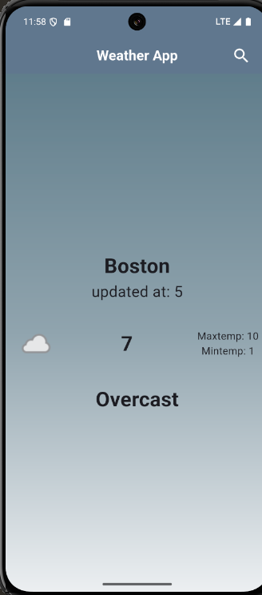
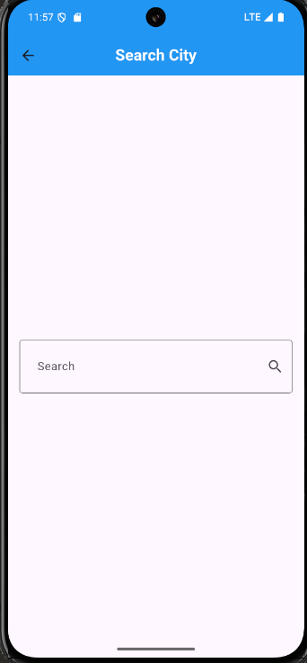
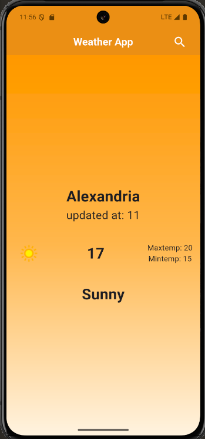

# 🌦️ Weather App

## 🚀 Overview

A modern Flutter weather application that provides real-time weather updates based on the user's current location or any searched city.

The app features dynamic UI themes that change based on weather conditions, creating a visually engaging experience.

---

## ✨ Features

* 📍 Get weather using current location
* 🔍 Search for any city worldwide
* 🌡️ Display temperature, min & max values
* ☁️ Show weather condition (Sunny, Overcast, etc.)
* 🎨 Dynamic background colors based on weather state
* ⚡ Fast and responsive UI using BLoC

---

## 🛠️ Tech Stack

* **Flutter & Dart**
* **BLoC (Cubit) State Management**
* **Weather API**
* **Geolocation Services**

---

## 📸 Screenshots

### 🌥️ Overcast Weather



### 🔍 Search Screen



### ☀️ Sunny Weather



---

## ⚙️ Installation

1. Clone the repository:

```bash
git clone https://github.com/fatma-gelil/Weather-App.git
```

2. Navigate to the project folder:

```bash
cd Weather-App
```

3. Install dependencies:

```bash
flutter pub get
```

4. Run the app:

```bash
flutter run
```

---

## 📂 Project Structure

```
lib/
 ├── cubit/
 ├── models/
 ├── services/
 ├── views/
 └── main.dart
```

---

## 🤝 Contributing

Contributions are welcome! Feel free to fork the repo and submit a pull request.

---

## 📄 License

This project is open-source and available under the MIT License.

---

## 🔗 Repository

👉 https://github.com/fatma-gelil/Weather-App
